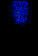
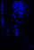
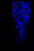
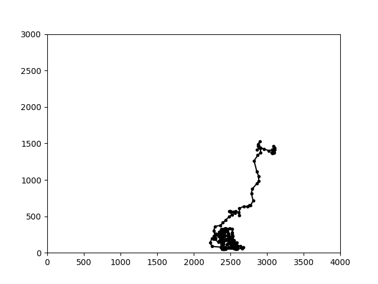
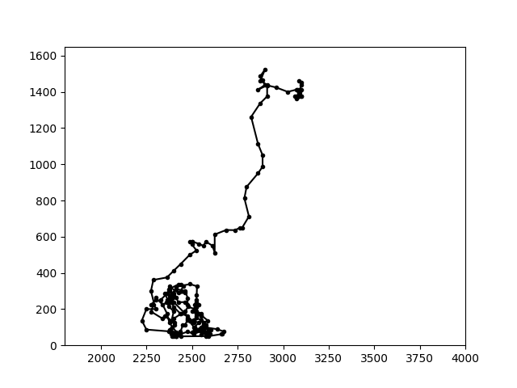
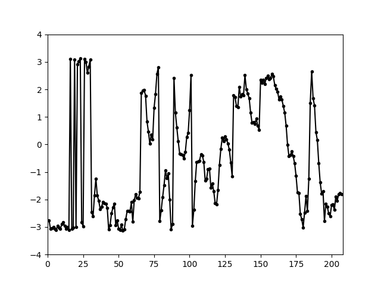
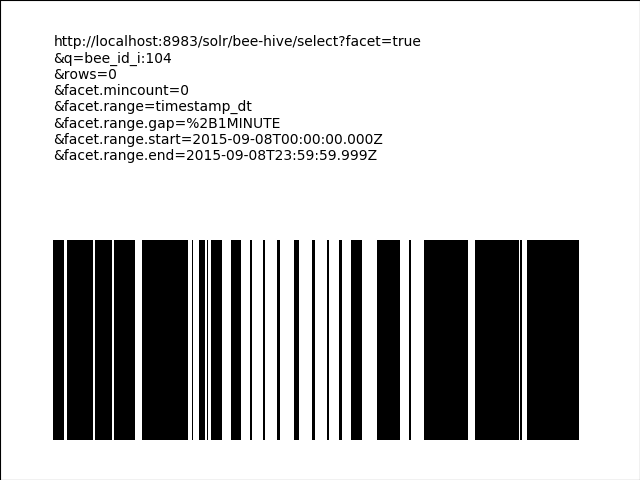
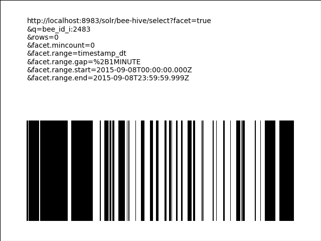
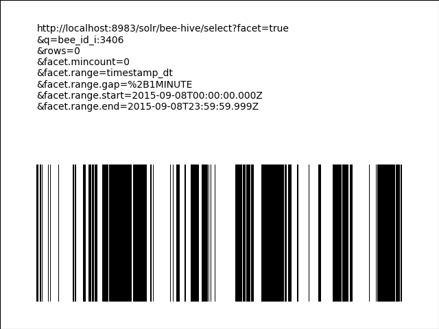
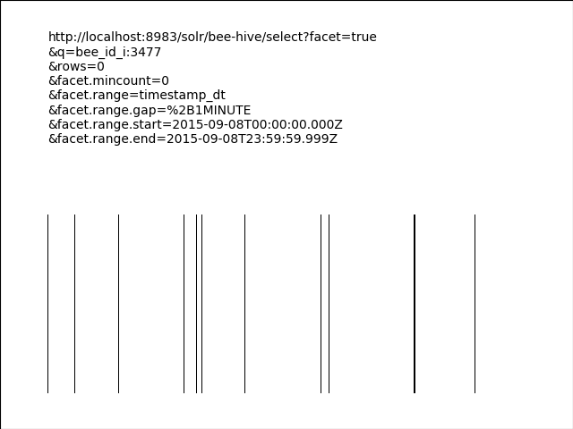

# Exploring the BeesBook 2015 dataset sample with Apache Solr 7.5

This article shares my first adventures exploring a real science, open access dataset with freely available open source software.

## Contents

* [About the BeesBook 2015 dataset sample](#about-the-beesbook-2015-dataset-sample)
* [About Apache Solr 7.5](#about-apache-solr-75)
* [Cloning this repo](#cloning-this-repo)
* [Downloading the dataset](#downloading-the-dataset)
* [Preprocessing the dataset](#preprocessing-the-dataset)
* [Downloading the software](#downloading-the-software)
* [Indexing the dataset](#indexing-the-dataset)
* [Faceting with bees](#faceting-with-bees)
* [Streaming expressions with bees](#streaming-expressions-with-bees)
* [Bee plots](#bee-plots)
* [Wrap up](#wrap-up)

#### Image previews

<html>
  <table>
    <tr>
      <td></td>
      <td></td>
      <td></td>
      <td></td>
      <td></td>
      <td></td>
    </tr>
  </table>
  <table>
    <tr>
      <td></td>
      <td></td>
      <td></td>
      <td></td>
    </tr>
  </table>
</html>

## About the BeesBook 2015 dataset sample

In their open access [Frontiers in Robotics and AI](https://www.frontiersin.org/journals/robotics-and-ai) journal paper entitled ["Tracking All Members of a Honey Bee Colony Over Their Lifetime Using Learned Models of Correspondence"](https://doi.org/10.3389/frobt.2018.00035) Boenisch et. al. [1] present an in-depth description of a multi-step algorithm which produces motion paths of automatically tracked marked honey bees. Alongside their paper, the team at Freie Universität Berlin published the first trajectory dataset for all bees in a colony, extracted from ∼3 million images covering 3 days [2].

The sample dataset entitled "BeesBook Recording Season 2015 Sample Release" is available online at https://www.synapse.org/#!Synapse:syn11737848 or via its Digital Object Identifier [doi: 10.7303/syn11737848.1](https://doi.org/10.7303/syn11737848.1). The full dataset comprises 71 days of continuous positional data (3 Hz sample rate) and in total 2,775 bees in a one-frame observation hive were marked and recorded with four cameras.

#### References
[1] Boenisch F, Rosemann B, Wild B, Dormagen D, Wario F and Landgraf T (2018) Tracking All Members of a Honey Bee Colony Over Their Lifetime Using Learned Models of Correspondence. Front. Robot. AI 5:35. [doi: 10.3389/frobt.2018.00035](https://doi.org/10.3389/frobt.2018.00035)

[2] Boenisch, F., Rosemann, B., Wild, B., Wario, F., Dormagen, D., and Landgraf, T. (2018). BeesBook Recording Season 2015 Sample. [doi: 10.7303/syn11737848.1](https://doi.org/10.7303/syn11737848.1)

## About Apache Solr 7.5

[Apache Solr](http://lucene.apache.org/solr) is an open source search platform based on the [Apache Lucene](http://lucene.apache.org/core) search engine library. As I'm writing this in late September 2018 the [latest release](http://lucene.apache.org/solr/downloads.html) is version 7.5.0. Lucene and Solr are both written in [Java](https://en.wikipedia.org/wiki/Java_(programming_language)) and are two of many open source software projects hosted by the not-for-profit [Apache Software Foundation](http://www.apache.org).

#### Disclaimer

In this article I am using Solr mainly because I'm already familiar with it and wish to learn more about its many features. As such what follows is _not_ an introductory Solr tutorial (which can be found [elsewhere](http://lucene.apache.org/solr/guide/7_5/solr-tutorial.html)) and quite possibly also not even the best tool for a dataset exploration job, but well, let's see how it goes.

## Cloning this repo

```
git clone https://github.com/cpoerschke/bee-informatics
cd bee-informatics/BeesBook2015-sample-with-ApacheSolr750
```

## Downloading the dataset

When I downloaded it the [BeesBook Recording Season 2015 Sample Release](https://www.synapse.org/#!Synapse:syn11737848) dataset was called `data_sample_release.csv`, contained about 200 million rows and it was about 19GB in size. Let's assume this large file is downloaded into the `data-sets` sub-directory.

```
$ pwd
/Users/cpoerschke/bee-informatics/data-sets

$ ls ./data_sample_release.csv
./data_sample_release.csv

$ wc -l ./data_sample_release.csv
 200145135 ./data_sample_release.csv
```

Working with such a large dataset is bound to take time. So let's try all steps out first with a partial dataset and if that works well the step can be repeated with the full dataset.

```
$ head -1000001 ./data_sample_release.csv > ./partial_data_sample_release.csv

$ wc -l ./partial_data_sample_release.csv
 1000001 ./partial_data_sample_release.csv
```

## Preprocessing the dataset

The dataset is conveniently in comma separated values (csv) format but we need to mildly pre-process the timestamp, x_pos and y_pos columns' format to suit our subsequent steps.

### Timestamp format trimming

The [sed](https://en.wikipedia.org/wiki/Sed) stream editor utility can be used to adjust the timestamp format. Illustration:

```
$ echo "2018-07-06 05:43:21.012345+00"
2018-07-06 05:43:21.012345+00

$ echo "2018-07-06 05:43:21.012345+00" | sed 's/\(....\-..\-..\) \(..:..:...*\)+00/\1T\2Z/g'
2018-07-06T05:43:21.012345Z
```

### (x,y) coordinate merging

The `sed` utility can also be used to merge and repeat the position columns. Illustration:

```
$ echo "1234,5678"
1234,5678

$ echo "1234,5678" | sed 's/\(.*\),\(.*\)/\1,\2,\1 \2/g'
1234,5678,1234 5678
```

### Coordinate scaling

If we assume that a coordinate is in the 0 .. 9999 range we can also, somewhat hackily perhaps, use the `sed` utility to map that down to 0.0000 .. 0.9999 scale. Illustration:

```
$ echo "1234,5678
987,654
3,21"
1234,5678
987,654
3,21

$ echo "1234,5678
987,654
3,21" | sed 's/\(.*\),\(.*\)/posX0000\1 posY0000\2/g'
posX00001234 posY00005678
posX0000987 posY0000654
posX00003 posY000021

$ echo "1234,5678
987,654
3,21" | sed 's/\(.*\),\(.*\)/posX0000\1 posY0000\2/g' | sed 's/posX.*\(....\) posY.*\(....\)/0\.\1 0\.\2/g'
0.1234 0.5678
0.0987 0.0654
0.0003 0.0021
```
### Triple sed script

The [prep-dataset.sh](../data-sets/prep-dataset.sh) script combines the above pre-processing steps into one convenient script.

```
$ pwd
/Users/cpoerschke/bee-informatics/data-sets

$ ls ./prep-dataset.sh
./prep-dataset.sh

$ ./prep-dataset.sh ./partial_data_sample_release.csv ./prepared-partial-dataset.csv
Input file: ./partial_data_sample_release.csv
Output file: ./prepared-partial-dataset.csv

$ ./prep-dataset.sh ./data_sample_release.csv ./prepared-dataset.csv
Input file: ./data_sample_release.csv
Output file: ./prepared-dataset.csv
```

#### Preprocessing speed

The `prep-dataset.sh` script uses `sed` three times. Alternatives to this no doubt exist e.g. a custom program or script that does just one pass through the dataset. However, we must balance any reduction in pre-processing time against the time required to develop such a custom tool. And well, if pre-processing is just a one-off job here then `sed` taking 40 minutes or so to do it will be just fine and provide an opportunity for a leisurely lunch or tea break I'd say.

## Downloading the software

* You can download the latest version Apache Solr at http://lucene.apache.org/solr/downloads.html or find older releases in the [Apache archives](http://archive.apache.org/dist/lucene/solr/). `solr-7.5.0.tgz` is about 161MB in size.

```
$ pwd
/Users/cpoerschke/bee-informatics/BeesBook2015-sample-with-ApacheSolr750

$ ls ./solr-7.5.0.tgz
./solr-7.5.0.tgz

$ tar xf ./solr-7.5.0.tgz

$ ls ./solr-7.5.0
CHANGES.txt		NOTICE.txt		contrib			example
LICENSE.txt		README.txt		dist			licenses
LUCENE_CHANGES.txt	bin			docs			server
```

## Indexing the dataset

We've got two choices here: a [Solr Cloud](http://lucene.apache.org/solr/guide/7_5/solrcloud.html) or a standalone Solr instance. For the purposes of this article, choosing the cloud option is preferred but if you wish to experiment on an offline computer (e.g. without wifi in flight-safe mode) then only the standalone Solr instance might work.

### Option 1: A Solr Cloud collection

```
$ pwd
/Users/cpoerschke/bee-informatics/BeesBook2015-sample-with-ApacheSolr750

$ ./solr-7.5.0/bin/solr start -m 16g -cloud -noprompt

$ ./solr-7.5.0/bin/solr create -c bee-hive -d _default -shards 1 -replicationFactor 1
```

### Option 2: A standalone Solr collection

```
$ pwd
/Users/cpoerschke/bee-informatics/BeesBook2015-sample-with-ApacheSolr750

$ ./solr-7.5.0/bin/solr start -m 16g

$ ./solr-7.5.0/bin/solr create_core -c bee-hive -d _default
```

### Option 1 and 2: Solr collection removal

The following commands can be used to delete an existing Solr collection and to stop the Solr instance when you're finished experimenting.

```
$ pwd
/Users/cpoerschke/bee-informatics/BeesBook2015-sample-with-ApacheSolr750

$ ./solr-7.5.0/bin/solr delete -c bee-hive

$ ./solr-7.5.0/bin/solr stop -all
```

### Posting bees

The [index-dataset.sh](index-dataset.sh) script is a simple wrapper around Solr's [Post Tool](http://lucene.apache.org/solr/guide/7_5/post-tool.html).

```
$ pwd
/Users/cpoerschke/bee-informatics/BeesBook2015-sample-with-ApacheSolr750

$ ls ../data-sets/prepared-partial-dataset.csv
../data-sets/prepared-partial-dataset.csv

$ ls ./index-dataset.sh
./index-dataset.sh

$ ./index-dataset.sh ../data-sets/prepared-partial-dataset.csv bee-hive
```

#### Default field types and dynamic fields

We have chosen the name `bee-hive` for our Solr collection and created it with the `_default` configset. This configset contains a number of default [fieldType](http://lucene.apache.org/solr/guide/7_5/solr-field-types.html) and [dynamicField](http://lucene.apache.org/solr/guide/7_5/dynamic-fields.html) definitions. This means, for example, that simply the `_i` and `_f` endings of the `bee_id_i` and `bee_id_confidence_f` field names indicate that those field values are of integer and floating point type.

#### Indexing speed

The partial dataset of just 1 million rows can be indexed relatively quickly, about 2 minutes on my computer. Indexing the full 200 million rows dataset will take longer.

```
$ pwd
/Users/cpoerschke/bee-informatics/BeesBook2015-sample-with-ApacheSolr750

$ ls ../data-sets/prepared-dataset.csv
../data-sets/prepared-dataset.csv

$ ls ./index-dataset.sh
./index-dataset.sh

$ ./index-dataset.sh ../data-sets/prepared-dataset.csv bee-hive
```

You can see indexing progress via the [http://localhost:8983/solr/bee-hive/select?q=\*:\*&rows=0](http://localhost:8983/solr/bee-hive/select?q=*:*&rows=0) search in your browser or on the command line.

```
curl "http://localhost:8983/solr/bee-hive/select?q=*:*&rows=0"
```

## Faceting with bees

In this section we explore the content of the dataset in a very broad sense using some of Apache Solr's [faceting](http://lucene.apache.org/solr/guide/7_5/faceting.html) functionality.

### Time range faceting

The year 2015 is part of the [BeesBook Recording Season 2015 Sample Release](https://www.synapse.org/#!Synapse:syn11737848) name and the [Tracking All Members of a Honey Bee Colony Over Their Lifetime Using Learned Models of Correspondence](https://doi.org/10.3389/frobt.2018.00035) article mentioned that the sample covers 3 days. Let's find out exactly which days we have data for.

#### Time range faceting (via classic faceting)

```
# request
curl "http://localhost:8983/solr/bee-hive/select?q=*:*&rows=0&facet=true\
&facet.range=timestamp_dt\
&facet.mincount=1\
&facet.range.gap=%2B1DAY\
&facet.range.start=2015-01-01T00:00:00.000Z\
&facet.range.end=2015-12-31T23:59:59.999Z"

# response
...
    "facet_ranges":{
      "timestamp_dt":{
        "counts":[
          "2015-09-07T00:00:00Z",69145434,
          "2015-09-08T00:00:00Z",68348046,
          "2015-09-09T00:00:00Z",62651654],
        "gap":"+1DAY",
        "start":"2015-01-01T00:00:00Z",
        "end":"2016-01-01T00:00:00Z"}},
...
```

#### Time range faceting (via the JSON Facet API)

```
# request
curl "http://localhost:8983/solr/bee-hive/select" -d 'q=*:*&rows=0&json.facet={
  timestamp_by_day : {
    type : range,
    field : timestamp_dt,
    mincount : 1,
    gap : "%2B1DAY",
    start : "2015-01-01T00:00:00.000Z",
    end   : "2015-12-31T23:59:59.999Z",
  }
}
'

# response
...
    "timestamp_by_day":{
      "buckets":[{
          "val":"2015-09-07T00:00:00Z",
          "count":69145434},
        {
          "val":"2015-09-08T00:00:00Z",
          "count":68348046},
        {
          "val":"2015-09-09T00:00:00Z",
          "count":62651654}]}}}
```

### Terms faceting

The [Tracking All Members of a Honey Bee Colony Over Their Lifetime Using Learned Models of Correspondence](https://doi.org/10.3389/frobt.2018.00035) article mentioned that in total 2,775 bees were marked. Let's count how many bees we have data for in the dataset sample.

```
# request
curl "http://localhost:8983/solr/bee-hive/select" \
-d 'q=*:*&rows=0&json.facet={
  most_seen_bee_ids : {
    type : terms,
    field : bee_id_i,
    numBuckets : true,
    sort : count,
    limit : 3
  }
}
'

# response
...
  "facets":{
    "count":200145134,
    "most_seen_bee_ids":{
      "numBuckets":4096,
      "buckets":[{
          "val":3258,
          "count":701513},
        {
          "val":3161,
          "count":585296},
        {
          "val":3772,
          "count":572558}]}}}
```

Hmm, clearly 4,096 is more than 2,775, how can that be? Let's restrict our search with a `bee_id_confidence_f` filter query and count again.

```
# request
curl "http://localhost:8983/solr/bee-hive/select?fq=bee_id_confidence_f:\[0.5+TO+1.0\]" \
-d 'q=*:*&rows=0&json.facet={
  most_seen_bee_ids : {
    type : terms,
    field : bee_id_i,
    numBuckets : true,
    sort : count,
    limit : 3
  }
}
'

# response
...
"facets":{
  "count":184306760,
  "most_seen_bee_ids":{
    "numBuckets":2683,
    "buckets":[{
        "val":3258,
        "count":698014},
      {
        "val":3161,
        "count":576489},
      {
        "val":3772,
        "count":571524}]}}}
```

### Query faceting

The [Tracking All Members of a Honey Bee Colony Over Their Lifetime Using Learned Models of Correspondence](https://doi.org/10.3389/frobt.2018.00035) article mentioned that four cameras were used to record the bees in a one-frame observation hive. Let's find the (x,y) coordinate range for one of the cameras.

```
# request
curl "http://localhost:8983/solr/bee-hive/select" -d 'q=*:*&rows=0&json.facet={
  cam_id_2_x_y : {
    type : query,
    q : "cam_id_s:2",
    facet : {
      min_x_pos_i : "min(x_pos_i)", max_x_pos_i : "max(x_pos_i)",
      min_y_pos_i : "min(y_pos_i)", max_y_pos_i : "max(y_pos_i)"
    }
  }
}
'

# response
...
  "facets":{
    "count":200145134,
    "cam_id_2_x_y":{
      "count":66507411,
      "min_x_pos_i":49,
      "max_x_pos_i":3953,
      "min_y_pos_i":47,
      "max_y_pos_i":2954}}}
```

### Heatmap faceting

We indexed bee coordinates as individual `x_pos_i` and `y_pos_i` integer fields and also in a joint `pos_srpt` field of `SpatialRecursivePrefixTreeFieldType` type for [Spatial Search](http://lucene.apache.org/solr/guide/7_5/spatial-search.html).

Let's start to create a heatmap of bee positions via the addition of the `facet.heatmap=pos_srpt` search parameter
* in your browser e.g. http://localhost:8983/solr/bee-hive/select?q=cam_id_s:2&rows=0&facet=true&facet.heatmap=pos_srpt or
* on the command line.
```
curl "http://localhost:8983/solr/bee-hive/select?q=cam_id_s:2&rows=0&facet=true&facet.heatmap=pos_srpt\
&facet.heatmap.geom=\[\"0+0\"+TO+\"0.4+0.3\"\]&facet.heatmap.gridLevel=5&indent=false"
```

As you can see by default `facet.heatmap=pos_srpt` heatmap results are returned in `counts_ints2D` matrix form. However, if we also add the `facet.heatmap.format=png` search parameter
* in your browser e.g. http://localhost:8983/solr/bee-hive/select?q=cam_id_s:2&rows=0&facet=true&facet.heatmap=pos_srpt&facet.heatmap.format=png

then the heatmap results will be in `counts_png` string form.

A few lines of [Python](https://en.wikipedia.org/wiki/Python_(programming_language)) code can easily save that string as a [.png format](https://en.wikipedia.org/wiki/Portable_Network_Graphics) image file.
```
import base64

fileName = ...
fileContent = ...

with open(fileName, "wb") as file:
  file.write(base64.b64decode(fileContent.encode("utf-8")))
```

The small [facet-heatmap.py](facet-heatmap.py) wrapper script can be used to generate different heatmaps.

<html>
  <table>
    <tr>
      <th>Command</th>
      <th>Heatmap</th>
    </tr>
    <tr>
      <td>./facet-heatmap.py ./bee-3258-cam-2.png 'bee_id_i:3258' 'cam_id_s:2'</td>
      <td></td>
    </tr>
    <tr>
      <td>./facet-heatmap.py ./bee-3161-cam-2.png 'bee_id_i:3161' 'cam_id_s:2'</td>
      <td></td>
    </tr>
    <tr>
      <td>./facet-heatmap.py ./bee-3772-cam-2.png 'bee_id_i:3772' 'cam_id_s:2'</td>
      <td></td>
    </tr>
  </table>
</html>

## Streaming expressions with bees

In this section we search for and find one or more (presumed to be) forager bees using some of Apache Solr's [Streaming Expressions](http://lucene.apache.org/solr/guide/7_5/streaming-expressions.html) functionality.

_(Streaming expressions are specific to Solr Cloud. If [earlier on](#indexing-the-dataset) you chose to start a standalone Solr instance you can now skip ahead to the [Mid-day bees](#mid-day-bees) section for a more manual approach of finding bees.)_

### 'search' stream source

```
# request
curl --data-urlencode 'expr=
  search(bee-hive,
         q="timestamp_dt:[2015-09-08T00:00:00Z-1MINUTE TO 2015-09-08T00:00:00Z+1MINUTE]",
         fl="bee_id_i",
         sort="bee_id_i asc",
         rows="3")
' "http://localhost:8983/solr/bee-hive/stream"

# response
{
  "result-set":{
    "docs":[{
        "bee_id_i":0}
      ,{
        "bee_id_i":0}
      ,{
        "bee_id_i":0}
      ,{
        "EOF":true,
        "RESPONSE_TIME":16}]}}
```

As mentioned in the [search](http://lucene.apache.org/solr/guide/7_5/stream-source-reference.html#search) stream source documentation the default `qt` query type is `/select` and with it the `rows` parameter is mandatory; the `/export` query type on the other hand always returns all rows.

```
# request
curl --data-urlencode 'expr=
  search(bee-hive,
         q="timestamp_dt:[2015-09-08T00:00:00Z-1MINUTE TO 2015-09-08T00:00:00Z+1MINUTE]",
         fl="bee_id_i",
         sort="bee_id_i asc",
         qt="/export")
' "http://localhost:8983/solr/bee-hive/stream"

# response
{
  "result-set":{
    "docs":[{
        "bee_id_i":0}
      ,{
        "bee_id_i":0}
...
      ,{
        "bee_id_i":4095}
      ,{
        "bee_id_i":4095}
      ,{
        "EOF":true,
        "RESPONSE_TIME":347}]}}
```

The dataset contains data from three days. The above expression finds data points around midnight between the first and the second day -- note that there is more than one data point for an individual bee.

### 'unique' stream decorator

We can use the [unique](http://lucene.apache.org/solr/guide/7_5/stream-decorator-reference.html#unique) stream decorator to reduce the many data points down to a list of individual bees seen around midnight.

```
# request
curl --data-urlencode 'expr=
  unique(search(bee-hive,
                q="timestamp_dt:[2015-09-08T00:00:00Z-1MINUTE TO 2015-09-08T00:00:00Z+1MINUTE]",
                fl="bee_id_i",
                sort="bee_id_i asc",
                qt="/export"),
         over="bee_id_i")
' "http://localhost:8983/solr/bee-hive/stream"

# response
{
  "result-set":{
    "docs":[{
        "bee_id_i":0}
      ,{
        "bee_id_i":9}
...
      ,{
        "bee_id_i":4093}
      ,{
        "bee_id_i":4095}
      ,{
        "EOF":true,
        "RESPONSE_TIME":103}]}}
```

### 'intersect' stream decorator

We can use the [intersect](http://lucene.apache.org/solr/guide/7_5/stream-decorator-reference.html#intersect) stream decorator to find a list of individual bees seen on consecutive days around midnight.

```
# request
curl --data-urlencode 'expr=
  intersect(
    unique(search(bee-hive,
                  q="timestamp_dt:[2015-09-08T00:00:00Z-1MINUTE TO 2015-09-08T00:00:00Z+1MINUTE]",
                  fl="bee_id_i",
                  sort="bee_id_i asc",
                  qt="/export"),
           over="bee_id_i"),
    unique(search(bee-hive,
                  q="timestamp_dt:[2015-09-09T00:00:00Z-1MINUTE TO 2015-09-09T00:00:00Z+1MINUTE]",
                  fl="bee_id_i",
                  sort="bee_id_i asc",
                  qt="/export"),
           over="bee_id_i"),
    on="bee_id_i")
' "http://localhost:8983/solr/bee-hive/stream"

# response
{
  "result-set":{
    "docs":[{
        "bee_id_i":0}
      ,{
        "bee_id_i":24}
...
      ,{
        "bee_id_i":4092}
      ,{
        "bee_id_i":4093}
      ,{
        "EOF":true,
        "RESPONSE_TIME":111}]}}
```

### 'complement' stream decorator

We can use the [complement](http://lucene.apache.org/solr/guide/7_5/stream-decorator-reference.html#complement) stream decorator to find a list of individual bees seen on consecutive days around midnight but _not_ seen around noon (mid-day).

```
# request
curl --data-urlencode 'expr=
  complement(
    intersect(
      unique(search(bee-hive,
                    q="timestamp_dt:[2015-09-08T00:00:00Z-1MINUTE TO 2015-09-08T00:00:00Z+1MINUTE]",
                    fl="bee_id_i",
                    sort="bee_id_i asc",
                    qt="/export"),
             over="bee_id_i"),
      unique(search(bee-hive,
                    q="timestamp_dt:[2015-09-09T00:00:00Z-1MINUTE TO 2015-09-09T00:00:00Z+1MINUTE]",
                    fl="bee_id_i",
                    sort="bee_id_i asc",
                    qt="/export"),
             over="bee_id_i"),
      on="bee_id_i"),
    unique(search(bee-hive,
                  q="timestamp_dt:[2015-09-08T12:00:00Z-10MINUTE TO 2015-09-08T12:00:00Z+10MINUTE]",
                  fl="bee_id_i",
                  sort="bee_id_i asc",
                  qt="/export"),
           over="bee_id_i"),
    on="bee_id_i")
' "http://localhost:8983/solr/bee-hive/stream"

# response
{
  "result-set":{
    "docs":[{
        "bee_id_i":104}
      ,{
        "bee_id_i":2483}
      ,{
        "bee_id_i":3406}
      ,{
        "bee_id_i":3477}
      ,{
        "EOF":true,
        "RESPONSE_TIME":2107}]}}
```

### Mid-day bees

Via the streaming expression above we have (with one `/stream` request in about two seconds) found the four bees not seen for (at least) the 20 minutes around noon on 2015-09-08 but previously and subsequently seen around midnight.

Streaming expressions are specific to Solr Cloud. Here's another, more manual approach of searching for the same thing with multiple queries in a [mid-day-bees.sh](mid-day-bees.sh) shell script.

```
$ ./mid-day-bees.sh
Searching for bees home at midnight on the 8th
Searching for bees home at midday   on the 8th
Searching for bees home at midnight on the 9th
Calculating bees home at midnight on the 8th and 9th
Calculating bees home at midnight but away at midday
Displaying number of bees per file
     655 midnight8.log
    2204 midday8.log
     484 midnight9.log
     270 midnight.log
       4 not-midday8.log
=== Bees home at midnight but away at midday ===
bee: 104
prev_seen
2015-09-08T11:47:57.324Z
next_seen
2015-09-08T12:19:20.151Z
------------------------------------------------
bee: 2483
prev_seen
2015-09-08T11:49:40.433Z
next_seen
2015-09-08T12:11:49.161Z
------------------------------------------------
bee: 3406
prev_seen
2015-09-08T11:43:46.385Z
next_seen
2015-09-08T12:49:48.172Z
------------------------------------------------
bee: 3477
prev_seen
2015-09-08T11:04:58.277Z
next_seen
2015-09-08T12:33:56.858Z
================================================
```

## Bee plots

In this section we use [matplotlib.pyplot](https://en.wikipedia.org/wiki/matplotlib) to visualise parts of the dataset, specifically focusing on four individuals i.e. the mid-day bees identified above.

#### Visualisation: time range faceting

The small [facet-range.py](facet-range.py) wrapper script can be used to visualise the results of time range faceting queries: black bars correspond to times the bee was seen and white bars indicate times when the bee was not seen.

```
for bee_id_i in 104 2483 3406 3477
do
  ./facet-range.py ./bee-${bee_id_i}-in-out-8.png "bee_id_i:${bee_id_i}" \
  --facet-range-start "2015-09-08T00:00:00.000Z" \
  --facet-range-end   "2015-09-08T23:59:59.999Z"
done
```

<html>
  <table>
    <tr>
      <td></td>
      <td></td>
    </tr>
    <tr>
      <td></td>
      <td></td>
    </tr>
  </table>
</html>

#### Investigation: to be(e) or not to be(e) real

Comparison of the four 'home or not?' visualisations clearly shows that bee 3477 is 'the odd one out' in our quartet of mid day bees.

Earlier in this article we used [terms faceting](#terms-faceting) and (time) [range faceting](#time-range-faceting-via-the-json-facet-api). Now let's combine them and see if [nested faceting](http://lucene.apache.org/solr/guide/7_5/json-facet-api.html#nested-facets) can help us to better understand the data.

```
# request
curl "http://localhost:8983/solr/bee-hive/select?fq=bee_id_i:(104+2483+3406+3477)" \
-d 'q=*:*&rows=0&json.facet={
  most_seen_bee_ids : {
    type : terms,
    field : bee_id_i,
    facet : {
      bee_id_confidence_quartiles : {
        type : range,
        field : bee_id_confidence_f,
        include : edge,
        gap : "0.25",
        start : "0.0",
        end   : "1.0",
      }
    }
  },
}
'

# response
...
  "facets":{
    "count":1034263,
    "most_seen_bee_ids":{
      "buckets":[{
          "val":104,
          "count":373973,
          "bee_id_confidence_quartiles":{
            "buckets":[{
                "val":0.0,
                "count":2194},
              {
                "val":0.25,
                "count":5795},
              {
                "val":0.5,
                "count":3394},
              {
                "val":0.75,
                "count":362590}]}},
        {
          "val":3406,
          "count":350665,
          "bee_id_confidence_quartiles":{
            "buckets":[{
                "val":0.0,
                "count":14580},
              {
                "val":0.25,
                "count":3952},
              {
                "val":0.5,
                "count":11510},
              {
                "val":0.75,
                "count":320623}]}},
        {
          "val":2483,
          "count":307759,
          "bee_id_confidence_quartiles":{
            "buckets":[{
                "val":0.0,
                "count":7169},
              {
                "val":0.25,
                "count":770},
              {
                "val":0.5,
                "count":609},
              {
                "val":0.75,
                "count":299211}]}},
        {
          "val":3477,
          "count":1866,
          "bee_id_confidence_quartiles":{
            "buckets":[{
                "val":0.0,
                "count":1862},
              {
                "val":0.25,
                "count":4},
              {
                "val":0.5,
                "count":0},
              {
                "val":0.75,
                "count":0}]}}]}}}
```

The nested faceting query results above clearly show
* that we have very few (`"count":1866`) data points for the fourth bee (`"val":3477`), and
* that the bee id confidence values for those few data points are almost all in the lowest quartile.

So it's probably fair to assume that 'bee 3477' is not actually real and that a few times some other bee or bees were mistakenly consider to be the 'bee 3477'.

#### Visualisation: (x,y) coordinate plots

The small [bee-plot.py](bee-plot.py) wrapper script can be used to visualise the results of queries such as http://localhost:8983/solr/bee-hive/select?q=bee_id_i:104&fq=cam_id_s:1&fl=x_pos_i,y_pos_i,timestamp_dt&sort=timestamp_dt+asc&rows=10.

```
./bee-plot.py ./bee-104-cam-1-plot.png      'bee_id_i:104' 'cam_id_s:1' \
'timestamp_dt:[2015-09-08T12:00:00Z+TO+2015-09-08T12:00:00Z%2B30MINUTES]' \
--rows=207 --axis    0 4000 0 3000

./bee-plot.py ./bee-104-cam-1-plot-zoom.png 'bee_id_i:104' 'cam_id_s:1' \
'timestamp_dt:[2015-09-08T12:00:00Z+TO+2015-09-08T12:00:00Z%2B30MINUTES]' \
--rows=207 --axis 1800 4000 0 1650
```

<html>
  <table>
    <tr>
      <td></td>
      <td></td>
    </tr>
  </table>
</html>

Looking at the full scale plot on the left and then zooming in via the plot on the right it seems that 'bee 104' is perhaps running around in circles in the (2500,200) coordinate area.

The dataset includes an orientation column and via the `--orientation orientation_f` argument we can use the [bee-plot.py](bee-plot.py) wrapper script to plot that column and see that bee 104's orientation does vary in the (-pi, +pi) range.

```
./bee-plot.py ./bee-104-cam-1-plot-angles.png 'bee_id_i:104' 'cam_id_s:1' \
'timestamp_dt:[2015-09-08T12:00:00Z+TO+2015-09-08T12:00:00Z%2B30MINUTES]' \
--rows=207 --axis 0 208 -4 +4 \
--orientation orientation_f
```

<html>
  <table>
    <tr>
      <td></td>
    </tr>
  </table>
</html>

## Wrap up

In this article I shared my first adventures exploring the [BeesBook Recording Season 2015 Sample Release](https://www.synapse.org/#!Synapse:syn11737848) with the open source search platform [Apache Solr](http://lucene.apache.org/solr) and a small number of short [Python](https://en.wikipedia.org/wiki/Python_(programming_language)) scripts.

* The open access nature of the dataset and the availability of open source software make it possible for interested citizens to explore scientific datasets.
* Questions such as 'which bees were seen at this time but not at that time?' can be asked and answered with relatively little computer programming expertise and 'home or not?' visualisations can provide a condensed and motivating view of slices of the dataset.
* Full colony heatmaps as well as short plots of an individual bee's movements offer a brief taste of the fantastic scope and resolution of this BeesBook 2015 dataset.

And that then leaves just one last question, what to pursue as the next adventure: 2,775 marked bees, 200 million data points over 3 days -- what would you wanna ask those bees?

