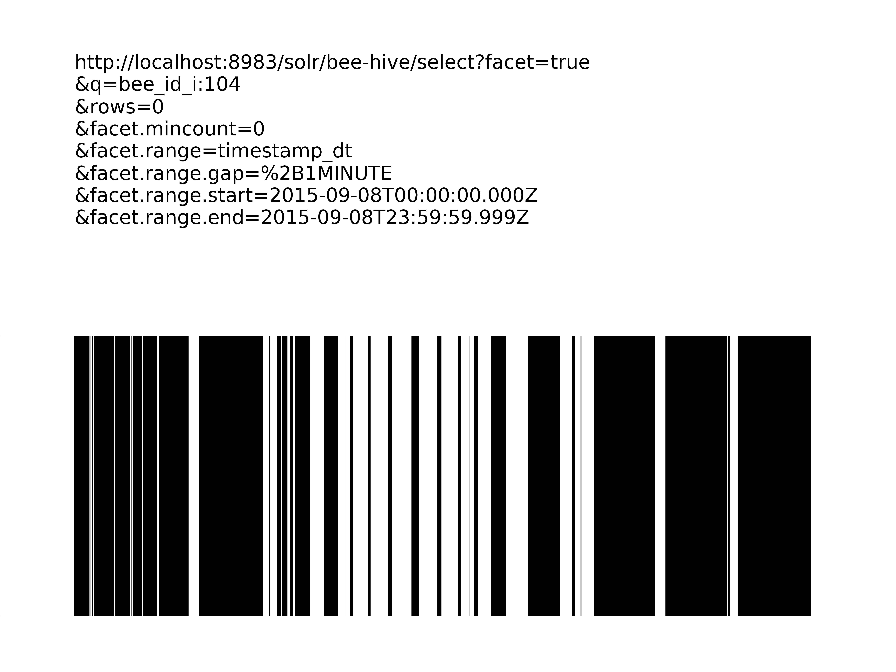
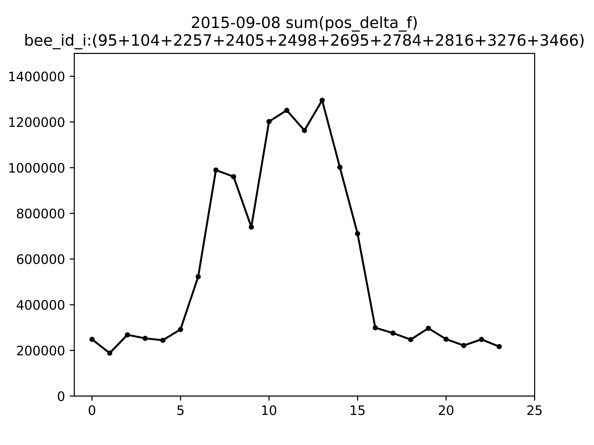
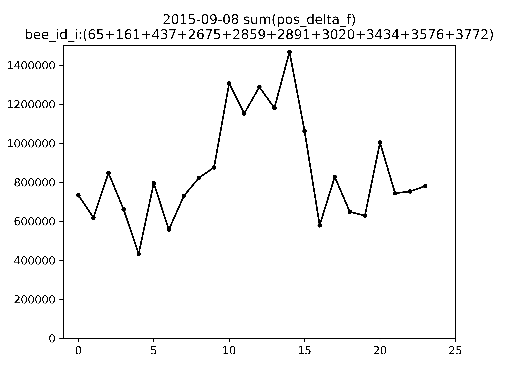
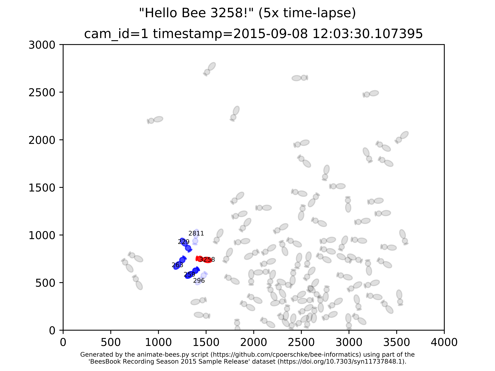
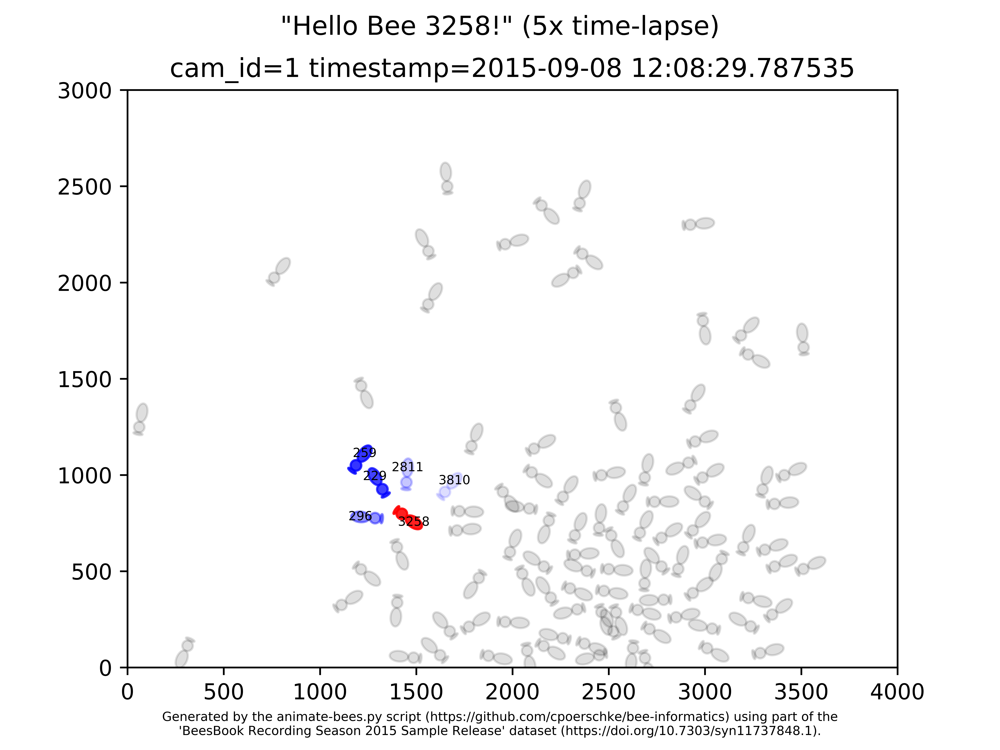

# Apimondia 2019

[This is a poster .pdf file placeholder link.](apimondia-2019-christine-poerschke.pdf)

## Appendix

### Generating QR codes

```
./create-qrcode-image.py --box_size 100 ./bee-animations-tweet-qrcode.png "https://twitter.com/BeeChristineP/status/1144704135574556673"

./create-qrcode-image.py --box_size 100 ./animate-bees-5x-trailer-mp4-qrcode.png "https://github.com/cpoerschke/bee-informatics/blob/master/bee-animations/animate-bees-5x-trailer.mp4?raw=true"
```

### Generating high-resolution images

```
# apply the patch

cd /Users/cpoerschke/bee-informatics

git apply ./apimondia-2019/high-res.patch


# generate bee-104-in-out-8.png at higher resolution

cd /Users/cpoerschke/bee-informatics/BeesBook2015-sample-with-ApacheSolr750

bee_id_i=104
./facet-range.py ../apimondia-2019/bee-${bee_id_i}-in-out-8.png "bee_id_i:${bee_id_i}" \
  --dots-per-inch 1200 \
  --facet-range-start "2015-09-08T00:00:00.000Z" \
  --facet-range-end   "2015-09-08T23:59:59.999Z"


# generate like-or-unlike images at higher resolution

cd /Users/cpoerschke/bee-informatics/bedtime-for-bees

./bee-step-stats-sum.sh


# extract (high resolution) frames from video

cd /Users/cpoerschke/bee-informatics/bee-animations

./process-input-files.sh
```

### Image previews

<html>
  <table>
    <tr>
      <td></td>
    </tr>
  </table>
  <table>
    <tr>
      <td></td>
      <td></td>
    </tr>
  </table>
  <table>
    <tr>
      <td></td>
      <td></td>
    </tr>
  </table>
  <table>
    <tr>
      <td></td>
      <td></td>
    </tr>
  </table>
</html>

