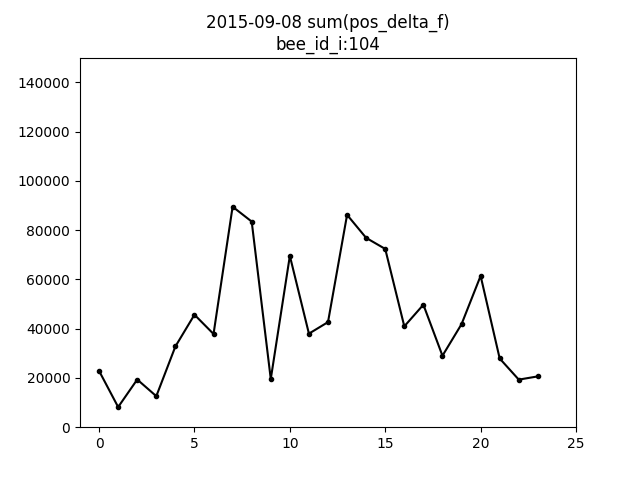

# Bedtime for bees is when?

The following article builds upon my [first "bee informatics" adventure](../BeesBook2015-sample-with-ApacheSolr750/README.md) and in this second installment here I hope to learn something about a bee colony's behaviour across a 24-hour day.

_(The "bedtime for bees" phrase in the title was inspired by the [Good Night Stories for Rebel Girls](https://en.wikipedia.org/wiki/Good_Night_Stories_for_Rebel_Girls) book.)_

## Contents

* [Recipe: curiosity, data, tools](#recipe-curiosity-data-tools)
* [Theory: a fitness tracker for bees?](#theory-a-fitness-tracker-for-bees)
* [Practice: calculating bees' steps](#practice-calculating-bees-steps)
* [Literature links: bee sleep](#literature-links-bee-sleep)
* [Analysis: hourly step sums](#analysis-hourly-step-sums)
* [Analysis: hourly step speeds](#analysis-hourly-step-speeds)
* [Analysis: whole colony step sums](#analysis-whole-colony-step-sums)
* [Discussion](#discussion)
* [Wrap up](#wrap-up)
* [References](#references)

## Recipe: curiosity, data, tools

* Curiosity: honeybees are social insects, several tens of thousands of related individuals live in one colony. How do they organise their lives? Is it possible to learn something about them remotely i.e. without personally 'meeting' and studying an entire colony of bees?

* Data: a team of researchers at Freie Universität Berlin published the first trajectory dataset for all bees in a colony, extracted from ∼3 million images covering 3 days [1] [2]. The sample dataset entitled "BeesBook Recording Season 2015 Sample Release" is available online: [doi: 10.7303/syn11737848.1](https://doi.org/10.7303/syn11737848.1).

* Tools: the availability of open source software is key to my investigation here, e.g.
  * [Apache Solr](http://lucene.apache.org/solr)
  * [Apache Maven](http://maven.apache.org)
  * [Python](https://en.wikipedia.org/wiki/Python_(programming_language))
  * [matplotlib.pyplot](https://en.wikipedia.org/wiki/matplotlib)
  * [NumPy](https://en.wikipedia.org/wiki/NumPy)

## Theory: a fitness tracker for bees?

Many commercial brands of activity or fitness tracker for humans are available. Irrespective of brand, activity tracking often includes an element of "step counting" e.g. via sensors worn on the wrist of one arm. Honeybees don't have arms, but they do have legs, six legs, and four wings.

When a bee is not flying her two pairs of wings can be folded over her back; when the wings are brought into flying position hooks on the leading edge of each hind wing hook into a fold on the rear edge of the front wing so that the two wings act as a single unit [3]. Bee legs are very intricate too, including for example antenna cleaners on the front legs and pollen baskets on the hind legs.

So, suffice it to say, pursuading many honeybees to 'wear' a sensor on their legs is impractical. However, the painting of coloured dots or the careful glueing of small tags to a bee's [thorax](https://en.wikipedia.org/wiki/Thorax_(insect_anatomy)) is an established research method, outlined for example in the 'Marking individual bees' section of the COLOSS BEEBOOK's behavioural studies chapter [4]. The team behind the [BeesBook 2015 dataset sample](https://doi.org/10.7303/syn11737848.1) recorded marked bees and then used computer vision and other algorithms to determine the bees' positions in the observation hive. Thus changes in position amount to "bee steps" or activity and that we can count and measure.

## Practice: calculating bees' steps

### A bee steps algorithm

Let's pick one bee and let's try to measure her steps. Bee 104 was one of four ["mid day bees"](../BeesBook2015-sample-with-ApacheSolr750/README.md#mid-day-bees) identified in my first "bee informatics" adventure. Here's some data points for Bee 104 after noon:

```
$ curl "http://localhost:8983/solr/bee-hive/select?rows=150&wt=csv\
&q=bee_id_i:104&fq=cam_id_s:1&fq=timestamp_dt:\[2015-09-08T12:00:00.000Z+TO+*\]\
&sort=timestamp_dt+asc&fl=id,timestamp_dt,x_pos_i,y_pos_i"

id,timestamp_dt,x_pos_i,y_pos_i
118521750,2015-09-08T12:19:20.151Z,3087,1374
118521751,2015-09-08T12:19:20.484Z,3088,1387
118521752,2015-09-08T12:19:20.817Z,3088,1400
...
112982424,2015-09-08T12:20:26.154Z,2577,63
112982425,2015-09-08T12:20:26.487Z,2589,51
113549751,2015-09-08T12:23:07.495Z,2388,49
```

We can calculate the 12:19:20.151 to 12:19:20.484 step length as the [Euclidean distance](https://en.wikipedia.org/wiki/Euclidean_distance) of (x1=3087,y1=1374) and (x2=3088,y2=1387) i.e.

```
distance = sqrt( (x2 - x1)^2 + (y2-y1)^2 )
         = sqrt( (3088 - 3087)^2 + (1387-1374)^2 )
         = sqrt( 1^2 + 13^2 )
         = sqrt( 1 + 169 )
         = sqrt( 170 )
         = 13.038
```

Can we simply repeat the same calculation for the 12:20:26.487 to 12:23:07.495 data points? No, we cannot since "a long time" elapsed between those two observations. Or more formally, here's a simple bee step definition:
>  One "bee step" (for our purposes) is the bee position distance of two consecutive recording frames from the same camera where less than 340ms time elapsed between frames, given that the dataset's recording rate was 3 frames per second.

### Be(e-)ing in two places at the same time

No one and no bee can be in two places at the same time, can they? Well, let's look at some data:

```
$ curl "http://localhost:8983/solr/bee-hive/select?rows=10&wt=csv\
&q=bee_id_i:104&fq=cam_id_s:2&fq=timestamp_dt:\[2015-09-08T12:23:16.000Z+TO+2015-09-08T12:23:16.999Z\]\
&sort=timestamp_dt+asc&fl=timestamp_dt,x_pos_i,y_pos_i,bee_id_confidence_f,frame_id_s"

timestamp_dt,x_pos_i,y_pos_i,bee_id_confidence_f,frame_id_s
2015-09-08T12:23:16.194Z,2512,2950,0.972703,9343878769398574846
2015-09-08T12:23:16.194Z,2376,2938,1.0,9343878769398574846
2015-09-08T12:23:16.527Z,2377,2938,1.0,15455188621544528808
2015-09-08T12:23:16.861Z,2389,2938,1.0,9390348386744551255
```

For Camera 2 at 12:23:16.194 we have Bee 104 in two different locations. The bee id confidence values of 0.972703 and 1.0 are both pretty good but logically there must be at least one case of mistaken identity here. For step counting purposes either location could be chosen, or we could choose neither and just capture that there was [ambiguity in the data](bee-error-analysis.sh) at 12:23:16.194 for this bee.

### Storing steps data

Calculating step lengths for a lot of bees and data points will take time, but once calculated we can store the measurements for use in subsequent analyses. Let's assume that the Solr instance from the [first "bee informatics" adventure](../BeesBook2015-sample-with-ApacheSolr750/README.md) is available and running locally on port 8983 and that (say) port 8984 is available for use by an additional new Solr instance.

```
$ pwd
/Users/cpoerschke/bee-informatics/bedtime-for-bees

$ ./solr-7.5.0/bin/solr start -m 16g -p 8984

$ ./solr-7.5.0/bin/solr create_core -c bee-steps -d _default -p 8984
```

Next, let's use a program written in [Java](https://en.wikipedia.org/wiki/Java_(programming_language)) to do three things:
* gather data from the existing `bee-hive` Solr collection on port 8983
* calculate bee step lengths
* store data and step lengths in the new `bee-steps` Solr collection on port 8984

```
$ cd /Users/cpoerschke/bee-informatics/bedtime-for-bees/calc-pos-delta

$ mvn clean install dependency:build-classpath -Dmdep.outputFile=./build-classpath.txt

$ CLASS_PATH="./target/calc-pos-delta-1.0.0-SNAPSHOT.jar:$(cat ./build-classpath.txt)"

$ java -cp $CLASS_PATH CalcPosDelta

Usage: <min bee id> <max bee id>
```

Let's start by running the program for a single bee e.g. the 'Bee 104' bee:

```
$ java -cp $CLASS_PATH CalcPosDelta 104 104
...
beeId=104 queryResponse.response.numFound=373973
updateResponse={responseHeader={status=0,QTime=22970}}
```

Next, let's run the program for all bees:

```
$ java -cp $CLASS_PATH CalcPosDelta 0 4095
```

You can observe the program's progress via its output and read its source code in the [calc-pos-delta/src/main/java](calc-pos-delta/src/main/java) directory.

The program will take some time to run for all the bees, please be patient. Undoubtedly the program could be written or run differently to make it faster. Alternatively, you could just let the program do the calculations overnight while you are sleeping.

## Literature links: bee sleep

On the subject of (bee) sleep, let me share three [ResearchGate](https://www.researchgate.net) links to interesting research articles:

* [Mapping Sleeping Bees within Their Nest: Spatial and Temporal Analysis of Worker Honey Bee Sleep](https://journals.plos.org/plosone/article?id=10.1371/journal.pone.0102316) by Klein et. al. [5]

* [Work or sleep? Honeybee foragers opportunistically nap during the day when forage is not available](https://www.researchgate.net/publication/216756537_Work_or_sleep_Honeybee_foragers_opportunistically_nap_during_the_day_when_forage_is_not_available) by Klein and Seeley [6]

* [Diurnal behavioural differences in forager and nurse honey bees (Apis mellifera carnica Pollm)](https://www.researchgate.net/publication/235744354_Diurnal_behavioural_differences_in_forager_and_nurse_honey_bees_Apis_mellifera_carnica_Pollm) by Crailsheim et. al. [7]

## Analysis

The [Faceting with bees](../BeesBook2015-sample-with-ApacheSolr750/README.md#faceting-with-bees) section in my first "bee informatics" adventure used some of Apache Solr's [faceting](http://lucene.apache.org/solr/guide/7_5/faceting.html) functionality and subsequently the [Bee plots](../BeesBook2015-sample-with-ApacheSolr750/README.md#bee-plots) section visualised data. In this second adventure here the [bee-step-stats-sum.sh](bee-step-stats-sum.sh) and [bee-step-stats-percentile.sh](bee-step-stats-percentile.sh) scripts, wrapping the [bee-step-stats.py](bee-step-stats.py) script, follow a similar approach and hence the following sub-sections will focus on results rather than full command line details.

### Analysis: hourly step sums

Let's consider the middle day of the three days in the [BeesBook 2015 dataset sample](https://doi.org/10.7303/syn11737848.1) and let's sum up step lengths for each hour to gauge the distance a bee walked in that time.



The `sum(pos_delta_f)` plot above for Bee 104 shows varying hourly step totals with approximately 20,000 and 80,000 as the lower and upper bounds. In section 2.2 of Boenisch et. al. [1] it is mentioned that 12 mm is approximately 200 pixels. If we assume that the `x_pos` and `y_pos` values in the dataset sample are in pixels then our calculated `pos_delta_f` values are also in pixels. On that basis 20,000 to 80,000 pixels per hour translates into 1.2 to 4.8 metres per hour.

Error and noise considerations aside, initially it's tempting to try to relate these metre distances to [bee hive](https://en.wikipedia.org/wiki/Beehive) dimensions. On second thought though the more interesting question concerns all the other bees: how typical or unusual is Bee 104, how far did the other bees walk?

Now, at this point we encounter the concept of [percentiles](https://en.wikipedia.org/wiki/Percentile) and visually it seems that Bee 104's profile is pretty similar to the blue 80th percentile line in the `percentile((80 90),sum(pos_delta_f))` plot below. Or putting it another way, only about 20 percent of bees walked more than Bee 104.

<html>
  <table>
    <tr>
      <td></td>
      <td></td>
      <td></td>
    </tr>
  </table>
</html>

### Analysis: hourly step speeds

Let's again consider the middle day of the three days in the [BeesBook 2015 dataset sample](https://doi.org/10.7303/syn11737848.1) and let's try to gauge a bee's walking speeds.

The `pos_delta_f` step lengths [calculated earlier](#a-bee-steps-algorithm) used bee positions from consecutive recording frames. Given a constant recording rate (of 3 frames per second) each `pos_delta_f` value is hence also an indication of speed e.g. "13.038 pixels from 12:19:20.151 to 12:19:20.484" is "13.038 pixels per 0.333 seconds" or about 39 pixels per second. Furthermore, via the 200 pixels is 12 mm approximation from section 2.2 of Boenisch et. al. we can translate 39 pixels per second into 2.34 millimetres per second.

<html>
  <table>
    <tr>
      <th>raw (pixels per 1/3 second) values</th>
      <th>scaled (millimetres per second) values</th>
    </tr>
    <tr>
      <td></td>
      <td></td>
    </tr>
  </table>
</html>

The raw and scaled `percentile((25 75),pos_delta_f)` plots above for Bee 104 shows varying hourly step speeds with a narrow range before 5am and after 10pm as well as an elevated lower bound between 7am and 2pm. How might this be interpreted?

What we have just seen here as the 25th and 75th percentile is also called the [interquartile range](https://en.wikipedia.org/wiki/Interquartile_range): a quarter of steps were slower than the lower bound of the range and a quarter of steps were faster than the upper bound of the range. Or putting it another way, if all steps are ordered by speed then the middle two quarters i.e. half of all steps fall within the bounds of the interquartile range.

### Analysis: whole colony step sums

Let's consider all three days in the [BeesBook 2015 dataset sample](https://doi.org/10.7303/syn11737848.1) and let's sum up step lengths for all the bees for each hour to gauge the total distances walked.

<html>
  <table>
    <tr>
      <td></td>
      <td></td>
      <td></td>
    </tr>
  </table>
</html>

The three `sum(pos_delta_f)` plots above show varying hourly step totals. The daytime values are clearly higher than nighttime values and both similarities and differences between days can be seen: baseline activity levels appear fairly similar on the three days and peak activity levels on the 9th are somewhat lower than on the 7th and 8th.

## Discussion

The percentiles plots in the [hourly step sums](#analysis-hourly-step-sums) section showed big differences in `sum(pos_delta_f)` magnitude. If the dataset's `bee_id_confidence` and/or `track_id` values had also been used as part of the bee step length calculations then the amount of noise in all the plots could have been reduced. Given that we have noise though then care must be taken when interpreting the Y values e.g. by looking more at broad and relative trends and less at absolute numbers, on the assumption that noise in the data is more or less similar across the X values i.e. over time.

The plots in the [whole colony step sums](#analysis-whole-colony-step-sums) section above on a colony level suggest lower activity between 5 pm and 6 am on the 3 days. The plots aggregate data into 1 hour i.e. 60 minute time slices. Aggregation into (say) 15 min slices could also be easily done. It would be interesting to look at the full 71 days dataset as 15 min time slices and to contextualise it with local weather data such as temperature and sunrise/sunset times.

The [hourly step sums](#analysis-hourly-step-sums) and [hourly step speeds](#analysis-hourly-step-speeds) sections featured one bee (Bee 104) and plotted some of her movement metrics. The [bee-facets.sh](bee-facets.sh) script does some number crunching to look for bees whose metrics are similiar or dissimilar to Bee 104. The two `sum(pos_delta_f)` plots below illustrate how different (the metrics for) two groups of bees can be. It would be interesting to look at the full 71 days dataset and to follow cohorts of bees over time as they develop from house bees into forager bees.

<html>
  <table>
    <tr>
      <td></td>
      <td></td>
    </tr>
  </table>
</html>

The [hourly step speeds](#analysis-hourly-step-speeds) section considered bee step speeds in aggregate time slices and for an individual bee. It would be interesting to see if non-aggregate step speeds could be used to help find [trophallaxis](https://en.wikipedia.org/wiki/Trophallaxis) i.e. food exchange interactions between bees.

## Wrap up

This concludes my second ["bee informatics"](../README.md) adventure using open source software and the [BeesBook 2015 dataset sample](https://doi.org/10.7303/syn11737848.1).

As a citizen scientist here I have gained and shared insights into the behaviour of a bee colony that neither me nor you (the reader) has personally seen or 'met'. I hope you enjoyed reading this article and would like to end by recommending Anand Varma's [The first 21 days of a bee's life](https://www.ted.com/talks/anand_varma_a_thrilling_look_at_the_first_21_days_of_a_bee_s_life) TED talk.

## References

[1] Boenisch F, Rosemann B, Wild B, Dormagen D, Wario F, Landgraf T (2018) Tracking All Members of a Honey Bee Colony Over Their Lifetime Using Learned Models of Correspondence. Front. Robot. AI 5:35. [https://doi.org/10.3389/frobt.2018.00035](https://doi.org/10.3389/frobt.2018.00035)

[2] Boenisch F, Rosemann B, Wild B, Wario F, Dormagen D, Landgraf T (2018) BeesBook Recording Season 2015 Sample. [https://doi.org/10.7303/syn11737848.1](https://doi.org/10.7303/syn11737848.1)

[3] Davis C (2011) The Honey Bee Inside Out. (2nd edition). Bee Craft Limited, Stoneleigh, UK.

[4] Scheiner R, Abramson CI, Brodschneider R, Crailsheim K, Farina WM, Fuchs S, Grünewald B, Hahshold S, Karrer M, Koeniger G, Koeniger N, Menzel R, Mujagic S, Radspieler G, Schmickl T, Schneider C, Siegel AJ, Szopek M, Thenius R (2013) Standard methods for behavioural studies of Apis mellifera. In V Dietemann; J D Ellis; P Neumann (Eds) The COLOSS BEEBOOK, Volume I: standard methods for Apis mellifera research. Journal of Apicultural Research 52(4). [https://dx.doi.org/10.3896/IBRA.1.52.4.04](https://dx.doi.org/10.3896/IBRA.1.52.4.04)

[5] Klein BA, Stiegler M, Klein A, Tautz J (2014) Mapping Sleeping Bees within Their Nest: Spatial and Temporal Analysis of Worker Honey Bee Sleep. PLoS ONE 9(7): e102316. [https://doi.org/10.1371/journal.pone.0102316](https://doi.org/10.1371/journal.pone.0102316)

[6] Klein BA, Seeley TD (2011) Work or sleep? Honeybee foragers opportunistically nap during the day when forage is not available. Animal Behaviour. 82. 77-83. [https://doi.org/10.1016/j.anbehav.2011.03.026](https://doi.org/10.1016/j.anbehav.2011.03.026)

[7] Crailsheim K, Hrassnigg N, Stabentheiner A (1996) Diurnal behavioural differences in forager and nurse honey bees (Apis mellifera carnica Pollm). Apidologie. 27. 235-244. [https://doi.org/10.1051/apido:19960406](https://doi.org/10.1051/apido:19960406)

