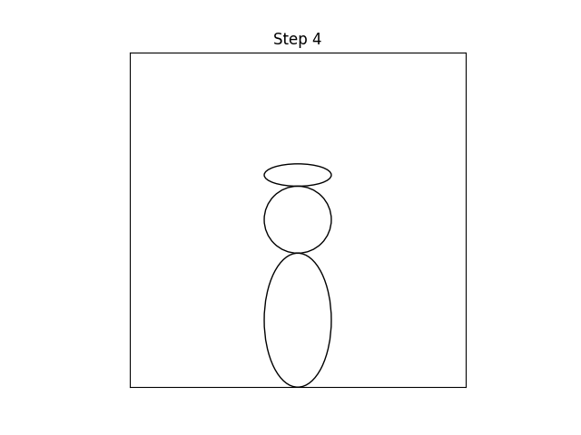

# Animating bees with Python and Matplotlib

This "bee informatics" adventure is about the visualisation of honeybee observation hive data as video material.

## Contents

* [How to draw a bee](#how-to-draw-a-bee)
* [Rotating, reusable bee drawings](#rotating-reusable-bee-drawings)
* [The BeesBook 2015 dataset](#the-beesbook-2015-dataset)
* [Visualising observation hive data](#visualising-observation-hive-data)
  * [Drawing a frame of bees](#drawing-a-frame-of-bees)
  * [Animating a frame of bees](#animating-a-frame-of-bees)
  * [Animating a hive of bees](#animating-a-hive-of-bees)
* [Discussion](#discussion)

## How to draw a bee

Let's start with one bee and let's draw on a piece of paper and/or write a small computer program to draw.

<html>
  <table>
    <tr>
      <td>Draw a circle in the middle of the paper.<p/><code>Circle(xy=[0, 0], radius=3)</code><p/>This represents the bee's thorax which is the middle part of the bee where its six legs and four wings are attached.</td>
      <td></td>
    </tr>
    <tr>
      <td>With a pencil draw an ellipse, as wide as the circle but twice as high.<p/><code>Ellipse(xy=[0, 0], width=6, height=12, linestyle='dotted')</code><p/>This represents the bee's abdomen which, for example, contains the bee's heart and honey stomach, and which typically looks segmented or stripey.</td>
      <td></td>
    </tr>
    <tr>
      <td>Oops, in step 2 I was unclear about the location of the ellipse relative to the circle, sorry! Luckily pencil can be erased, so let's do that and move the ellipse downwards so that its upper tip touches the bottom edge of the circle.<p/><code>Ellipse(xy=[0,-9], width=6, height=12)</code><p/>The petiole (waist) connects the bee's thorax and abdomen.</td>
      <td></td>
    </tr>
    <tr>
      <td>Towards the front of the bee the thorax connects to the bee's head capsule.<p/>Let's draw it as an ellipse as wide as the circle but only a third as high.<p/><code>Ellipse(xy=[0, 4], width=6, height=2)</code></td>
      <td></td>
    </tr>
    <tr>
      <td>Finally, let's label our drawing.<p/><code>text(x=0, y=4, s='head')</code><p/><code>text(x=0, y=0, s='thorax')</code><p/><code>text(x=0, y=-9, s='abdomen')</code></td>
      <td></td>
    </tr>
  </table>
</html>

Congratulations, you've drawn a simple representation of a bee. A corresponding python script is [draw-a-bee.py](./draw-a-bee.py) in this repo and if you're feeling playful or artistic why not extend it to also draw the bee's antennae, legs and wings?

## Rotating, reusable bee drawings

One upward-facing bee is not enough. In this section we'll draw arbitrarily facing bees.

One bee can be drawn with a triplet of shapes:
```
Circle(xy=[0, 0], radius=3)
Ellipse(xy=[0,-9], width=6, height=12)
Ellipse(xy=[0, 4], width=6, height=2)
```

Three bees in a line can be drawn with repeated triplets of shapes:
```
for x in [-10, 0, +10]:
  Circle(xy=[x, 0], radius=3)
  Ellipse(xy=[x,-9], width=6, height=12)
  Ellipse(xy=[x, 4], width=6, height=2)
```

But what if only the middle bee faces upwards and the left bee faces right and the right bee faces left?

The [elliptical_bee_test.py](./elliptical_bee_test.py) script does three things:
* take command line arguments such as the bee's horizontal position and orientation
* use code from the [elliptical_bee.py](./elliptical_bee.py) module to determine the shapes to be drawn
* draw the shapes

The [elliptical_bee.py](./elliptical_bee.py) module's `info` function takes inputs (thorax_x, thorax_y, bee_height, angle_radians) and does calculations to determine the size, location and orientation of each bee part: head, thorax, abdomen.

```
./elliptical_bee_test.py --angle-degrees -30 --output-file-name elliptical-bee-minus-30-degrees.png
./elliptical_bee_test.py --angle-degrees   0 --output-file-name elliptical-bee-0-degrees.png
./elliptical_bee_test.py --angle-degrees +60 --output-file-name elliptical-bee-plus-60-degrees.png
```

<html>
  <table>
  <td></td>
  <td></td>
  <td></td>
  </table>
</html>

The commands above draw three hypothetical bees, each bee on its own. Next, let's draw many real bees all together on one frame.

## The BeesBook 2015 dataset

Alongside their open access [Frontiers in Robotics and AI](https://www.frontiersin.org/journals/robotics-and-ai) journal paper entitled ["Tracking All Members of a Honey Bee Colony Over Their Lifetime Using Learned Models of Correspondence"](https://doi.org/10.3389/frobt.2018.00035) [1] a team at Freie Universität Berlin published the first trajectory dataset for all bees in a colony, extracted from ∼3 million images covering 3 days [2].

The sample dataset entitled "BeesBook Recording Season 2015 Sample Release" is available online at https://www.synapse.org/#!Synapse:syn11737848 or via its Digital Object Identifier [doi: 10.7303/syn11737848.1](https://doi.org/10.7303/syn11737848.1). The full dataset comprises 71 days of continuous positional data (3 Hz sample rate) and in total 2,775 bees in a one-frame observation hive were marked and recorded with four cameras.

#### References
[1] Boenisch F, Rosemann B, Wild B, Dormagen D, Wario F and Landgraf T (2018) Tracking All Members of a Honey Bee Colony Over Their Lifetime Using Learned Models of Correspondence. Front. Robot. AI 5:35. [doi: 10.3389/frobt.2018.00035](https://doi.org/10.3389/frobt.2018.00035)

[2] Boenisch, F., Rosemann, B., Wild, B., Wario, F., Dormagen, D., and Landgraf, T. (2018). BeesBook Recording Season 2015 Sample. [doi: 10.7303/syn11737848.1](https://doi.org/10.7303/syn11737848.1)

## Visualising observation hive data

Let's use one hour of data from the middle of the "BeesBook Recording Season 2015 Sample Release" dataset.

### Drawing a frame of bees

Let's take a file called `2015-09-08_120000_097383.csv` which contains the position, orientation and id number of all bees seen by one observation hive camera at one moment in time: `2015-09-08 12:00:00.097383`

To visualise that data the [draw-bees.py](./draw-bees.py) script reads all the lines in the file and then uses the [elliptical_bee.py](./elliptical_bee.py) module to draw them.

```
./draw-bees.py --input-file-name ./2015-09-08_120000_097383.csv --output-file-name ./draw-a-frame.png
./draw-bees.py --input-file-name ./2015-09-08_120000_097383.csv --output-file-name ./label-a-frame.png --label-all-bees
```

<html>
  <table>
  <td></td>
  <td></td>
  </table>
</html>

Optionally we can also put selected bees 'into the spotlight' to highlight something interesting.

```
./draw-bees.py --input-file-name ./2015-09-08_120000_097383.csv \
               --output-file-name ./highlight-a-frame.png \
               --spotlight-bee-ids 3258 229 263 259 296 344 3576 2811
```
Notice in the bottom left of the image how bee 3258 is surrounded by about seven bees orientated towards her.

<html>
  <table>
  <td></td>
  </table>
</html>

### Animating a frame of bees

Let's focus on bee 3258 and observe her for 15 minutes or so from 12:00 to 12:15 that day: [animate-a-bee.mp4 (10 MB)](https://github.com/cpoerschke/bee-informatics/blob/master/bee-animations/animate-a-bee.mp4?raw=true)

```
./animate-bees.py --input-file-name ./2015-09-08_1200_to_1214.csv \
                  --output-file-name ./animate-a-bee.mp4 \
                  --cam-id 1 \
                  --focal-bee-id 3258
```

Clearly the bees that surround the (red) bee 3258 interact with her. Let's label and color-code any bees that 'meet' the red bee, dark hues of blue for frequently met contacts and lighter hues for bees that only briefly met the red bee.

```
./animate-bees.py --input-file-name ./2015-09-08_1200_to_1229.csv \
                  --output-file-name ./animate-bees-5x.mp4 \
                  --cam-id 1 \
                  --focal-bee-id 3258 \
                  --focal-bee-meet-radius 166 \
                  --frames-per-second 15
```

[animate-bees-5x.mp4 (14 MB)](https://github.com/cpoerschke/bee-informatics/blob/master/bee-animations/animate-bees-5x.mp4?raw=true) time-lapses 30 minutes real-time (12:00 to 12:30) into 6 minutes of animation.

### Animating a hive of bees

Let's look at bee 3258's movement in the observation hive via all cameras and for a full hour e.g. 60 minutes time-lapsed into 6 minutes of animation: [animate-bees-10x.mp4 (55 MB)](https://github.com/cpoerschke/bee-informatics/blob/master/bee-animations/animate-bees-10x.mp4?raw=true)

```
./animate-bees.py --input-file-name ./2015-09-08_1200_to_1259.csv \
                  --output-file-name ./animate-bees-10x.mp4 \
                  --dots-per-inch 150 \
                  --label-no-bees \
                  --focal-bee-id 3258 \
                  --focal-bee-meet-radius 166 \
                  --frames-per-second 30
```

In the animation notice the bees' interactions with the red bee 3258 when she is stationary and also how other bees orientate towards her or follow her when she moves across the comb.

## Discussion

This article visualised honeybee observation hive data as video material. Using freely available open source software parts of the open "BeesBook Recording Season 2015 Sample Release" dataset were shown as moving image sequences of cartoon-style bees. The source code written as part of this article is available [alongside it](./) and the animations raise a number of questions that would be interesting to pursue further in an citizen science way.

* Bee identity: The "BeesBook Recording Season 2015 Sample Release" does not include information about the bees' age or cast; are they all female worker bees or are some of them male bees i.e. drones? And is one of them perhaps the colony's queen bee? The bee animations showing interactions with bee 3258 certainly made me wonder if bee 3258 could be the queen bee.

* Queen and worker bee interactions: If the identity of the queen bee and the age of the labelled worker bees were known then interactions could be studied in greater detail: How old are the queen's attendants and how do they vary in their interactions with her? Are there day-time vs. night-time differences e.g. due to the reduced presence in the hive of forager bees during the day? What about seasonal differences and local weather and foraging conditions? Existing bee research has of course looked at such questions but perhaps high resolution data over extended periods of time could yield further interesting insights.

* Machine learning: To the human eye a bee being surrounded by a group of other bees is relatively easy to spot. Could machine learning techniques be used to find such and other interesting things in large honeybee observation hive datasets? Big data techniques applied to a hive of small insects if you like.

## Appendix

* one minute trailer: [animate-bees-5x-trailer.mp4 (2.2 MB)](https://github.com/cpoerschke/bee-informatics/blob/master/bee-animations/animate-bees-5x-trailer.mp4?raw=true)
