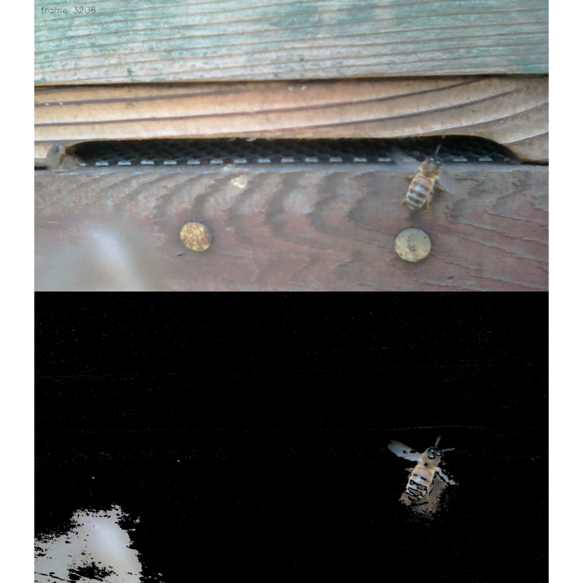
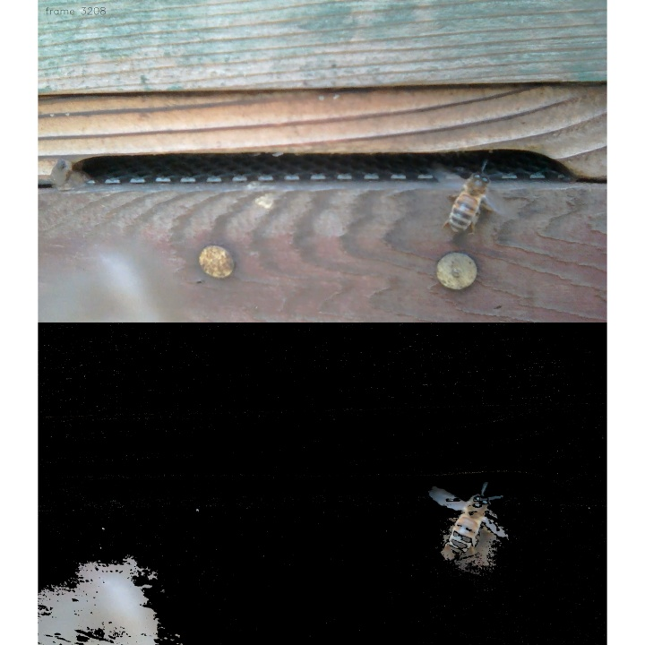

# Background subtraction with bees

Have you ever wondered how video conferencing software can replace real camera background with alternative imagery?

In this article I'd like to try out some basic background subtraction algorithms, with a little help from my bees.

## OpenCV background subtraction

OpenCV is an open-source computer vision library. The 4.5.5 release's `core` module includes the "K-nearest neighbours" and "Gaussian mixture model" [background subtraction algorithms](https://docs.opencv.org/4.5.5/d7/df6/classcv_1_1BackgroundSubtractor.html) and additional algorithms are available in the `bgsegm` and `cuda` contrib modules.

## Reasons to leave the hive

The video used in this article was recorded on an unusually warm January day, using an old phone simply placed sideways in front of the hive entrance. But why would a sensible bee leave its beehive in winter?

* As temperatures drop, a wintering bee colony clusters inside its nest, remaining relatively inactive and consuming its honey stores to generate heat.
* An individual bee can hold metabolic waste during the winter, waiting for suitably warm weather for a "cleansing flight" outside the nest.
* Bees need regular access to water, for example to dilute their stored honey, and they have been observed collecting water even in winter.

## Input, processing, output

* The `cv::VideoCapture` and `cv::VideoWriter` classes are well-documented and easy-to-use.
* A `cv::BackgroundSubtractor` processing object is also easily created and individual video frames are then passed to its `apply` method.
* The `apply` method's output is an image _mask_ which denotes background pixels with a _zero_ and non-background pixels with a _non-zero_ value.
* The mask can then be used in a `Mat::copyTo` operation to copy only the foreground areas of the original image onto an image with alternative background.

## Show me the bees

In the selected ~30 seconds video sequence we have:
* a few bees leaving the hive and others returning to it,
* one bee briefly walking across the camera lens, and
* another bee enthusiastically fanning at the entrance upon her return to the hive.

Each image is divided into two halves: the top showing the original image and the bottom showing only the foreground as detected via the default `cv::BackgroundSubtractorKNN` and `cv::BackgroundSubtractorMOG2` algorithms. The algorithms were run at the original 1920x1088 pixels resolution but final frames have been scaled to 720x720 resolution to limit file sizes.

### Video sequences
* [VID_20220101_145249-knn-background-3109-to-3399.mp4](./VID_20220101_145249-knn-background-3109-to-3399.mp4)
* [VID_20220101_145249-mog2-background-3109-to-3399.mp4](./VID_20220101_145249-mog2-background-3109-to-3399.mp4)

### Sample images

* frame 3208 with default KNN algorithm

* frame 3208 with default MOG2 algorithm

## Show me the code

* `background-subtractor-demo` source code: [src/demo.cpp](src/demo.cpp)
* detailed build and run steps: [src/README.md](src/README.md)

Any technical hiccups? Not really. I'd chosen C++ as the programming language to work with here and the OpenCV tutorials contained all the necessary "getting started" information. The `cv::VideoWriter`'s `fourcc` argument was a bit puzzling at first but a little online research led to [Advanced Video Coding](https://en.wikipedia.org/wiki/Advanced_Video_Coding) and [High Efficiency Video Coding](https://en.wikipedia.org/wiki/High_Efficiency_Video_Coding) Wikipedia reading and then both `H264` and `HEVC` worked as codecs.

## Further reading

* OpenCV documentation: https://docs.opencv.org/4.5.5/
* Seeley, Thomas D. (2019) The Lives of Bees. Princeton University Press.
* Winston, Mark L. (1987) The Biology of the Honey Bee. Harvard University Press.

