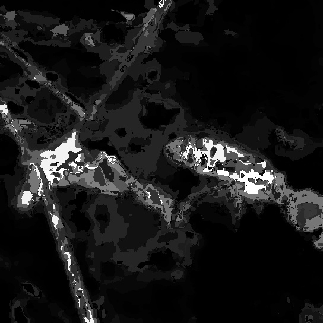

# Intelligent scissors and 256 shades of bee

In this article I'd like to learn about image segmentation and histogram-based image processing, with a little help from a water-collecting bee.

Four OpenCV APIs will be used -- `IntelligentScissorsMB`, `calcHist`, `calcBackProject` and `meanShift` -- but first, let's meet the bee.

## Show me the bee

Honeybees forage for four things:
* nectar, as a source of carbohydrates;
* pollen, as a source of protein;
* propolis, as a building material to seal unwanted cracks and holes in the nest;
* water, for example to dilute their stored honey and to maintain the nest temperature via evaporative cooling.

After her foraging trip the water-collecting bee will transfer the liquid to bees working inside the nest. The water-receiving bees will then use and distribute it further.

The interaction between the water-collecting and water-receiving bees includes a feedback mechanism:
* if water is speedily unloaded then the foragers will collect more;
* if the foragers have difficulty transferring their current water load then they will collect less.

## Intelligent scissors: around the bee in 8 clicks

OpenCV is an open-source computer vision library. The 4.5.5 release's [imgproc](https://docs.opencv.org/4.5.4/d7/dbd/group__imgproc.html) module includes an [IntelligentScissorsMB](https://docs.opencv.org/4.5.4/df/d6b/classcv_1_1segmentation_1_1IntelligentScissorsMB.html) class to find an optimal path between two points in an image.

Image segmentation with "intelligent scissors" is interactive:
1. the user mouse-clicks to determine the start of a path and then the `buildMap` API computes all the optimal paths from that starting point.
2. when the user moves the mouse the `getContour` API is used to draw the optimal path between the starting point and the current mouse point.
   * A direct line is the shortest path between two points, but it won't be optimal for most objects.
   * The optimal path is indirect because it adapts and snaps to object boundaries.
3. the user mouse-clicks to determine the end of a path.
4. the end point of the previous path can be the starting point for the next path.
5. segmentation is complete when the last end point is close to the first starting point.

From theory to practice, here's how intelligent scissors can be(e) ...

Let's begin with the 1st click at the pointy end of the bee's abdomen (in the middle of the image) and (moving towards the right of the image) let's make the 2nd click at the top edge of the bee's thorax.

Moving from the top edge of the bee's thorax, place the 3rd click at the bottom of the bee's head.

Moving back towards the middle of the image, place the 4th click near the top of the bee's hind leg.

Then, the 5th click near the foot of the bee's hind leg.

And then the 6th click is again near the top of the bee's hind leg.

The 7th click is at the bottom edge of the bee's abdomen.

And finally, the 8th click is again at the pointy end of the bee's abdomen.

So with 8 easy clicks we've described the area of the image that contains the bee.

Next:
* The `cv::drawContours` API can paint the bee foreground in (say) white on a (say) black background.
* The foreground/background mask can help describe the bee image's colour mix.

## Histograms: not quite "black and yellow"

To compute a colour histogram we:
* divide the overall colour space into buckets -- for example `black red green yellow blue magenta cyan white` -- and then
* count how many image pixels fall into each bucket.

Scaling of the raw counts -- for example into a 0..100 range -- can help compare different histograms:
* For the overall image `cyan` is the most common colour: `27 11 0 14 21 0 100 62`
* If the foreground/background mask is used to consider only the bee's colour then "black and red and yellow" are the most common colours: `100 73 0 73 13 0 12 61`

Just 8 buckets to describe a colour mix is clearly limiting. Here's the histograms with 27 buckets:
* `5 6 0 0 10 0 0 0 0 7 1 0 18 75 16 0 0 2 0 0 0 75 100 0 0 43 13`
* `13 24 0 0 45 5 0 0 0 8 2 0 6 99 65 0 0 7 0 0 0 0 10 0 0 6 3`

If we used even more buckets to describe the bee's colour mix -- say `8 * 8 * 8 = 512` colours -- what could we then do with such a description?

## Back projection: 256 shades of bee

To compute a back projection for an image we:
* scale the raw "bee colour mix" histogram counts into a 0..255 range and then
* call the `cv::calcBackProject` API with the scaled histogram and the image.

The `cv::calcBackProject` API:
* maps each input pixel's colour to the corresponding histogram bucket and then
* uses the bucket count to colour the output pixel.

Bucket counts in a 0..255 range correspond to shades of gray on a black..white scale. A lighter shade of gray indicates a higher bucket count and a higher probability of the image pixel colour being common in the colour mix that describes the bee.

##  Mean shift: follow me

The `cv::meanShift` API and back projections of the "bee colour mix" histogram can be used to track our water-collecting bee.

The first video frame shows the initial search windows, each centered based on the gray scale back projection.

The placement of a search window on the second video frame is computed as follows:
* Use the `cv::calcBackProject` API and the "bee colour mix" histogram to show, for the second video frame, areas with higher and lower probability.
* Use the search window's position on the first video frame as a starting point for the second frame.
* Use the `cv::meanShift` API to iteratively shift the search window so that it becomes centered on the image areas with higher probability.

The 2nd video frame's computed search window then helps find the 3rd frame's window which helps find the 4th and so on.

On video frame 492 note how
* the bee's wings are folded over her abdomen, and that
* the "bee colour mix" still helps locate the bee.

On the frame 555 back projection note how
* the bee's middle and hind leg are light gray areas of probability, and that
* the bee's front legs are lifted when she is moving them across her proboscis.

On the frame 580 back projection note how
* the smallest (red) search window is well placed on the bee's thorax, but
* the largest (blue) search window misses the bee's abdomen because the twig in front of the bee matches the "bee colour mix" quite well.

### Tracking video sequence

* [VID_20220409_142117-shades-HEVC.mp4](./VID_20220409_142117-shades-HEVC.mp4?raw=true)

## Show me the code

* source code:
  * [src/intelligentScissors-demo.cpp](src/intelligentScissors-demo.cpp)
  * [src/calcHist-demo.cpp](src/calcHist-demo.cpp)
  * [src/calcBackProject-demo.cpp](src/calcBackProject-demo.cpp)
  * [src/meanShift-demo.cpp](src/meanShift-demo.cpp)
* detailed build and run steps: [src/README.md](src/README.md)

## Further reading

* OpenCV documentation: [https://docs.opencv.org/4.5.5/](https://docs.opencv.org/4.5.5/)
* Seeley, Thomas D. (2019) The Lives of Bees. Princeton University Press.
* Mortensen, Eric N. and Barrett, William A. (1995) Intelligent Scissors for Image Composition. [https://doi.org/10.1145/218380.218442](https://doi.org/10.1145/218380.218442).
* Winston, Mark L. (1987) The Biology of the Honey Bee. Harvard University Press.

