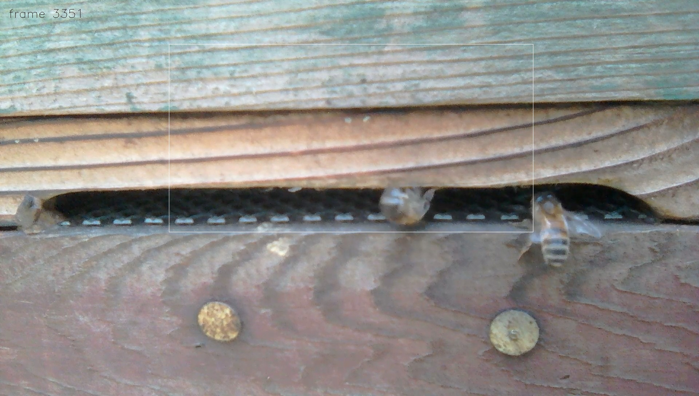
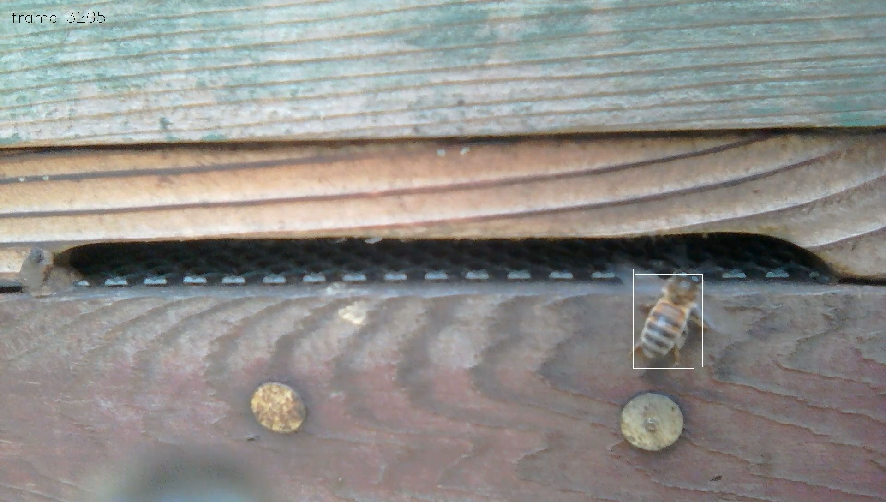

# YOLO with bees

In this article I'd like to learn about the YOLO (You Only Look Once) object detection system, with a little help from my bees.

## Neural networks, YOLO, OpenCV

* Neural networks as a computer science [concept](https://en.wikipedia.org/wiki/Artificial_neural_network) have been around for decades. In more recent years, advances in computing power and the availability of big amounts of data have enabled many practical applications of neural networks.

* YOLO is an approach where a single neural network performs object detection directly on the image and in one evaluation i.e. You Only Look Once.

* OpenCV is an open-source computer vision library. The 4.5.5 release's [dnn](https://docs.opencv.org/4.5.5/d6/d0f/group__dnn.html) module includes a `Net` class to create and manipulate neural networks as well as `readNetFrom...` functionality to import different network representations.

## Show me the bees

Let's use the hive entrance video from my previous "Background subtraction with bees" [article](../bg-sub/README.md) to look at some object detection examples.

* frame 3197 with one detection: the bee has been detected as an object and the white bounding box quite accurately identifies its location and size; the two drawing pins have not been detected;

* frame 3351 with one detection: the white bounding box represents an object prediction; predictions can be wrong;

* frame 3205 with two detections: the bee has been detected and the two overlapping bounding boxes both quite accurately identify its location and size; how to choose between the two boxes?

* frame 3139 with multiple detections: the drawing pin to the left is fully visible but the bee's body hides much of the right drawing pin from view; how to interpret the three bounding boxes? which box best predicts the bee and/or which predicts the drawing pin?

## Input, processing, output

Next, let's look at the steps that transformed the hive entrance "input" video into the object detections "output" [video](./VID_20220101_145249-yolo-3109-to-3399.mp4?raw=true).

Inputs:
* The `cv::VideoCapture` class is used to read individual images in a video.
* A `cv::dnn::Net` model is created with the `cv::dnn::readNetFromDarknet` method which takes a configuration file and a weights file as parameters. Configurations and weights for many pretrained YOLO models are publicly available, here I used YOLOv3.

Processing:
* Each 1920 x 1088 rectangular image is split into three 1088 x 1088 squares: the left part of the image, the center part of the image and the right part of the image.
* The YOLOv3 model expects a 416 x 416 dimension of values in the 0..1 range. The `cv::dnn::blobFromImage` function converts our 1088 x 1088 square image into a 416 x 416 blob representation suitable for use with the `cv::dnn::Net` model.
* The `blob` becomes the model input via a `cv::Net::setInput` method call; the model outputs are computed and returned by the `cv::Net::forward` method.

Outputs:
* Structure:
  * The neural network model produces multiple outputs, corresponding to different grid areas of the image.
  * Each individual output contains 85 floating point numbers:
    * the 1st and 2nd number predict the center of the object,
    * the 3rd and 4th number predict the width and height of the object, and
    * the 5th number indicates the confidence of the prediction.
    * The 6th to 85th numbers each correspond to one of 80 object classes; so the 6th number predicts that the object belongs to class 1, the 7th number is the probability for class 2, and so on.
* Filtering:
  * A minimum threshold for object confidence is applied.
  * The object class with the highest probability is chosen for each output and a minimum class probability threshold is also applied.
  * Non maximum suppression can be performed with the `cv::dnn::NMSBoxes` function, to reduce multiple outputs for the same object. For demonstration simplicity I've omitted this computation.
* Visualisation:
  * Using the [object_detection_classes_yolov3.txt](https://github.com/opencv/opencv/blob/4.5.5/samples/data/dnn/object_detection_classes_yolov3.txt) listing a class id (1, 2, 3, etc.) could be mapped to a descriptive label (person, bicycle, car, etc.). However, I have omitted that since none of the 80 classes represent a bee or an insect i.e. all descriptive labels would be wrong.
  * The `cv::rectangle` function is used to draw the detection(s) onto the original image.
  * Lastly, the `cv::VideoWriter` class and/or the `cv::imwrite` function is used to save the image, if and only if at least one object was detected.

## Show me the code

* `yolo-bees-demo` source code: [src/demo.cpp](src/demo.cpp)
* detailed build and run steps: [src/README.md](src/README.md)

Any hiccups? Not quite a hiccup, but one thing was a bit confusing:
* the YOLOv3 paper reports results for three methods (YOLOv3-320 YOLOv3-416 YOLOv3-608), and
* OpenCV's [models.yml](https://github.com/opencv/opencv/blob/4.5.5/samples/dnn/models.yml) specifies 416 x 416 dimensionality for YOLO, but
* the downloaded `yolov3.cfg` configuration specifies 608 x 608 in the `[net]` section.
Looking at OpenCV's open-source(!) code showed that in [ReadDarknetFromCfgStream](https://github.com/opencv/opencv/blob/4.5.5/modules/dnn/src/darknet/darknet_io.cpp#L677) the values for width and height are read. But should those same values therefore also be used with the `cv::dnn::blobFromImage` function?

Any surprises? The list of 80 object classes included a frisbee! Yes, a frisbee is not a bee ... but all the same it was nice to discover that a general purpose pretrained neural network model can detect some bees in my hive entrance video.

## Further reading

* OpenCV documentation: https://docs.opencv.org/4.5.5/
* Redmon J, Divvala S, Girshick R, Farhadi A (2016) You Only Look Once: Unified, Real-Time Object Detection. [arXiv](https://arxiv.org/abs/1506.02640).
* Redmon J, Farhadi A (2018) YOLOv3: An Incremental Improvement. [arXiv](https://arxiv.org/abs/1804.02767).

